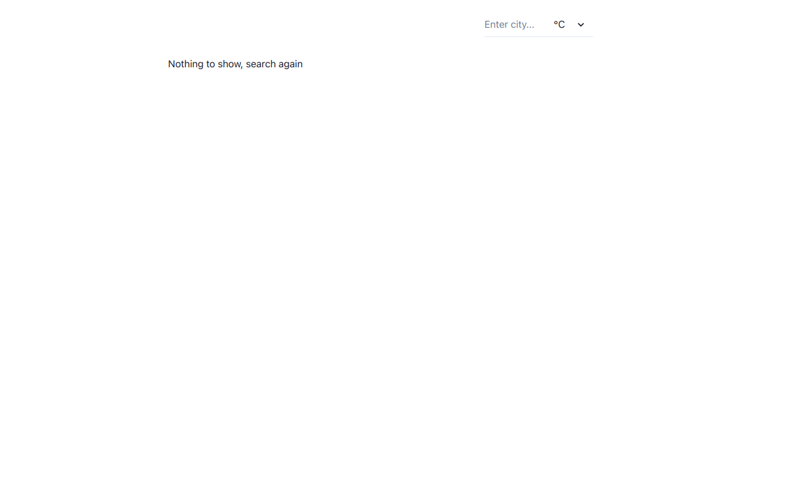

# Project: Weather App

- Live link: <https://odin-weather-pzsmyoowk-justestif.vercel.app/>

## Purpose

- A capstone project on understanding of api and working with async code.
- Project page: <https://www.theodinproject.com/lessons/node-path-javascript-weather-app>

## Using

- Next.Ts
- Chakra-ui
